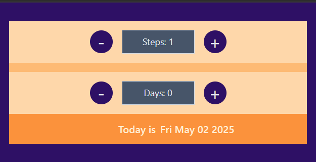
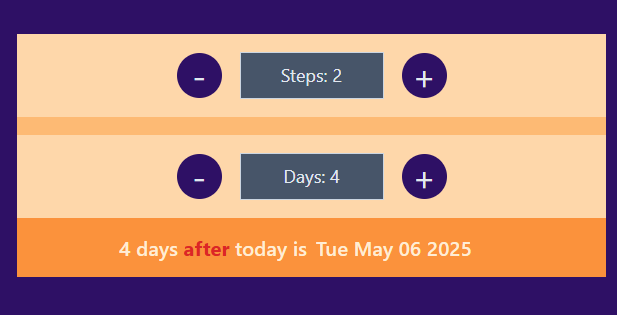
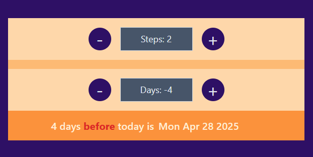

# React + Vite

# 📅 Date Stepper Project

The "Date Stepper" project aims to enhance understanding of state management and the useState hook in React.

---

## ✨ Features

- 🛠️ **The first Stepper**: Allows users to specify the number of days to count.
- 🛠️ **Days Counter Stepper**: Dynamically adjusts based on the value selected in the first Stepper.

## Upon selecting a number of days in the Days Counter Stepper, the application calculates the future date by adding the specified number of days to the current date. The calculated date is then displayed below the days counter, providing a visual representation of date manipulation based on user input.

## 📸 Demo

> **Published on Vercel**  
> [date Stepper project](https://date-stepper.vercel.app/)

---

## 📸 Screenshots / Demo

Here are some screenshots showcasing the features of the project:





## 🛠️ Installation and Usage

Follow these steps to run the project locally:

### 1. Clone the repository

```bash
git clone https://github.com/Tamer-E-Amer/date-stepper.git

```

### 2. Navigate into the project directory

```bash
cd date-stepper
```

### 3. Install dependencies

```bash
npm install
```

### 4. Start the development server

```bash
npm run dev
```

## 📋 Technologies Used

- ⚛️ **React.js** — Frontend library for building the UI
- 🎨 **Tailwind CSS** — Utility-first CSS framework for styling
- ⚡ **Vite.js** — Lightning fast development build tool

## 🤝 Contributing

Contributions are welcome!  
If you have ideas for improvements or new features, feel free to open an issue or submit a pull request.

## 📄 License

This project is licensed under the [MIT License].

## 📬 Contact

Created with ❤️ by [Tamer Amer]
